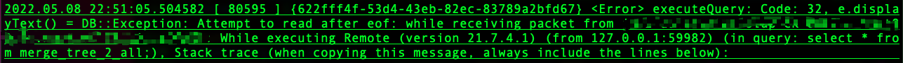

# **Clickhouse TCP 和 HTTP 接口下分布式查询处理源码分析**

> 背景： 在做分布式查询优化的时候，想要解决在initial节点发送给远程副本时远程副本因为某种原因crash掉导致整个查询失败的情况。但由于整个过程是流式处理的，因此在crash之前客户端就已经收到远程副本返回的数据，这样就会导致一个问题是，如果重新发送query给另一个远程副本的话，最终的结果肯定会有重复数据。

具体的报错信息：Attempt to read after eof. 



先说结果：流式处理所以不大好解决这个问题，而且交互式分析下的集群高可用性，主要是指分布式写入时候的高可用，保证用户每次写入能够成功。但是对于分布式查询，我们是可接受部分查询失败的，让客户端重试即可。并不是需要做到对用户完全的透明，我的理解是写入肯定得保证正确写入，但是对于查询其实失败了客户端应该也能很快收到报错（毕竟是OLAP引擎），那客户端再重新查询也没有太大的问题。

首先，Clickhouse可以通过HTTP或者TCP协议使用不同的服务，如果Clikhouse开启对应的端口监听就可以处理相应的请求。比如有HTTP原生协议连接，TCP（Client端）原生协议连接，MySQL兼容性接口连接，gRPC协议接口服务等。
比如
```
/// HTTP
            const char * port_name = "http_port";
            createServer(listen_host, port_name, listen_try, [&](UInt16 port)
            {
                Poco::Net::ServerSocket socket;
                auto address = socketBindListen(socket, listen_host, port);
                socket.setReceiveTimeout(settings.http_receive_timeout);
                socket.setSendTimeout(settings.http_send_timeout);

                servers->emplace_back(
                    port_name,
                    std::make_unique<HTTPServer>(
                        context(), createHandlerFactory(*this, async_metrics, "HTTPHandler-factory"), server_pool, socket, http_params));

                LOG_INFO(log, "Listening for http://{}", address.toString());
            });
```
```
port_name = "mysql_port";
            createServer(listen_host, port_name, listen_try, [&](UInt16 port)
            {
                Poco::Net::ServerSocket socket;
                auto address = socketBindListen(socket, listen_host, port, /* secure = */ true);
                socket.setReceiveTimeout(Poco::Timespan());
                socket.setSendTimeout(settings.send_timeout);
                servers->emplace_back(port_name, std::make_unique<Poco::Net::TCPServer>(
                    new MySQLHandlerFactory(*this),
                    server_pool,
                    socket,
                    new Poco::Net::TCPServerParams));

                LOG_INFO(log, "Listening for MySQL compatibility protocol: {}", address.toString());
            });
```

上面这些端口号从clickhouse的config.xml配置文件中读取（如果有的话），在Server::main()开启监听并等待客户端的连接请求。在这次场景中，主要是看了Clickhouse Server对于HTTP接口的查询请求和TCP（Clickhouse client端）的查询请求过程的源码。

## **1. TCP**
先说一下调用栈吧，全路径的调用栈大概是这样的：

```TCPHandler::runImpl()``` -> ```TCPHandler::processOrdinaryQueryWithProcessors()``` -> ```PullingAsyncPipelineExecutor::pull(Block & block, uint64_t milliseconds)``` -> ```PullingAsyncPipelineExecutor::pull(Chunk & chunk, uint64_t milliseconds)``` -> ```PullingAsyncPipelineExecutor::threadFunction(PullingAsyncPipelineExecutor::Data & data, ThreadGroupStatusPtr thread_group, size_t num_threads)``` -> ```PipelineExecutor::execute(size_t num_threads)``` -> ```PipelineExecutor::executeImpl(size_t num_threads)``` -> ```PipelineExecutor::executeSingleThread(size_t thread_num, size_t num_threads)``` -> ```PipelineExecutor::executeStepImpl(size_t thread_num, size_t num_threads, std::atomic_bool * yield_flag)``` -> ```PipelineExecutor::addJob(ExecutingGraph::Node * execution_state)``` -> ```executeJob(IProcessor * processor)``` -> ```ISource::work()``` -> ```RemoteSource::tryGenerate()```

至此，在```RemoteSource::tryGenerate()```中分为两个阶段，第一个阶段是将Query发送给各个分片的某个副本（这里会用到连接池的一个优先级策略，之后再文章细说）。发送之后，需要进行接收，接收的过程就是一个流式处理。简单的说，就是读取一部分数据就返回一部分数据，它最终是以Block流异步读取返回的。上面的报错就是来源于```RemoteSource::tryGenerate()```中的```RemoteQueryExecutor::read(std::unique_ptr<ReadContext> & read_context [[maybe_unused]])```函数，而这里的**ReadContext**在初始化的时候就会构造一个```RemoteQueryExecutorRoutine```, 在这个函数中调用```read_context->resumeRoutine()```会触发```RemoteQueryExecutorRoutine::operator()```函数，其中```MultiplexedConnections::receivePacketUnlocked(AsyncCallback async_callback)```，会接收Block流数据。在**receivePacketUnlocked**函数中有一个选择replica来读取数据。

也就是说，我们可以同时向某个shard的所有replica都发送查询请求，然后通过select轮询去获取数据。经过查看，确实在Clickhouse当中有一个```max_parallel_replicas```参数控制同时发送的replica数目，但是需要该表定义了**Sampling key**，其实就是在每个replica各取一部分数据，比如```max_parallel_replicas = 3```，那么每个replica取1/3的数据。但在默认情况下```max_parallel_replicas```是为1的，也就是只从一个replica上读数据。假如没有**Sampling key**是会导致最终数据结果有问题的，**join**操作也是同理。 

```MultiplexedConnections::receivePacketUnlocked(AsyncCallback async_callback)```中会去调用```Connection::receivePacket()```,里面再调用底层的```readVarUInt```,最后因为断开连接，initial节点继续读取数据就会报```attempt to read after eof```错误。

上述的所有过程都在```TCPHandler::processOrdinaryQueryWithProcessors()```的while循环中，当Block被返回时，就会通过TCPHandler::sendData()返回数据给客户端。

当然，这是真正在执行pipeline的过程，而生成pipeline的函数是在```TCPHandler::runImpl()```中的```Interpreter::executeQuery()```中，也就是parser解析sql生成抽象语法树（AST），然后**InterpreterFactory**工厂类根据AST生成解释器Interpreter实例，在生成实例之前会对AST进行简单分析和优化，解释AST生成计划树（QueryPlan），这是一颗逻辑树，其实就是QueryPlanStep树，当然还有最后将逻辑树转换成物理计划树QueryPipeline，并用BlockIO封装，这是用```QueryPlan::buildQueryPipeline()```方法完成的。

```QueryPlan::buildQueryPipeline()```方法将QueryPlanStep结点自底向上转换成IProcessor实例对象，也就是物理计划树上的结点。最开始说的调用栈里的```PullingAsyncPipelineExecutor```就是来执行这个生成的物理树的。

有点扯远了，这方面的内容还需要再仔细看看，以后有时间发文章再说。


## **2.HTTP**
其实HTTP查询请求处理和TCP的类似，只是使用不同的Server进行RequestHandle，具体的调用栈就是
```HTTPHandler::handleRequest(HTTPServerRequest & request, HTTPServerResponse & response)``` -> ```HTTPHandler::processQuery``` -> ```Interpreter::executeQuery(...)``` -> ```PipelineExecutor::execute(size_t num_threads)```

这里的```Interpreter::executeQuery(...)```和TCP中的不大一样，TCP中的只是生成了物理执行计划，而HTTP中的函数既生成了物理执行计划，还包括了执行。在进入了```PipelineExecutor->execute```之后和TCP的就差不多了，也就不多说了。

还有值得一提的是，在用HTTP接口查询的时候可以通过**query_parameter**来控制最终的结果发送。在发送请求之后加上```wait_end_of_query=1```来控制initial节点将结果写入本地的临时文件中，等所有的数据都处理完之后，才会把数据发送给客户端。因此是否可以通过这个功能，重发请求给远程副本再重写文件将结果发给客户端，这需要再深入研究。


